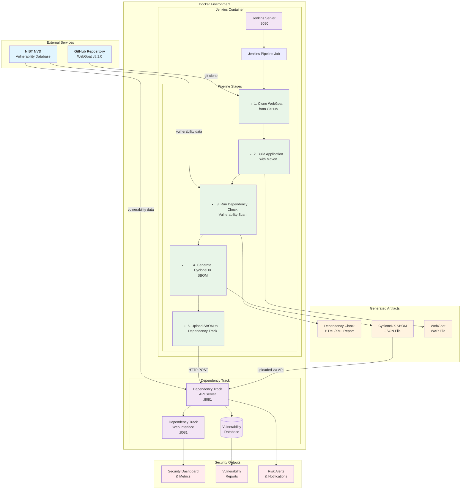

# Mend.io Security Demo - OWASP Dependency Track + Jenkins Integration

This repository contains a complete demonstration of integrating OWASP Dependency Track with Jenkins for automated vulnerability scanning and Software Bill of Materials (SBOM) management.

## Quick Start

1. **Prerequisites**
   - Docker and Docker Compose installed
   - At least 8GB RAM available
   - Ports 8080, 8081, 8082 available

2. **Clone and Start**
   ```bash
   git clone <this-repo-url>
   cd mend-security-demo
   make setup
   ```

3. **Access Services**
   - Jenkins: http://localhost:8080 (admin/admin)
   - Dependency Track: http://localhost:8081 (admin/admin)
   - Dependency Track Frontend: http://localhost:8082

4. **Run Demo**
   ```bash
   make demo
   ```

## Services Overview

- **Jenkins**: CI/CD orchestration and pipeline execution
- **OWASP Dependency Track**: Vulnerability management and SBOM analysis
- **PostgreSQL**: Database for Dependency Track
- **WebGoat**: Target application for vulnerability demonstration

## Architecture



For detailed setup instructions, see [docs/INSTALLATION.md](docs/INSTALLATION.md)