# 🛡️ Mend.io Security Demo - OWASP Dependency Track + Jenkins Integration

> **Complete Software Supply Chain Security Demonstration**
> 
> This repository demonstrates enterprise-grade security scanning integration using OWASP Dependency Track, Jenkins, and automated SBOM (Software Bill of Materials) generation.

## 🎯 What This Demo Shows

- **Automated CI/CD Security Scanning** - Vulnerability detection integrated into development workflow
- **Software Bill of Materials (SBOM)** - Complete inventory of application dependencies
- **Centralized Risk Management** - Dependency Track for ongoing vulnerability monitoring
- **Industry Standards Compliance** - CycloneDX SBOM format, OWASP tools integration

---

## ⚡ Quick Start

### Prerequisites
- Docker and Docker Compose installed
- 8GB+ RAM available
- Ports 8080, 8081, 8082 available

### One-Command Setup
```bash
git clone https://github.com/JMAR-DNY/mend_security_demo
cd mend-security-demo
make setup
```

**⏰ Initial setup takes 10-15 minutes** (downloads images, installs plugins, configures services)

### Access Your Demo Environment
- **Jenkins**: http://localhost:8080 (admin/admin)
- **Dependency Track**: http://localhost:8081 (admin/admin)  
- **DT Frontend**: http://localhost:8082

---

## 🎬 Running the Demo

### Quick Demo Execution
```bash
make demo
```

### Manual Steps
1. **Access Jenkins**: http://localhost:8080 (admin/admin)
2. **Find Pipeline**: Look for `webgoat-security-scan` job
3. **Start Scan**: Click "Build Now"
4. **Monitor Progress**: Watch real-time pipeline execution
5. **Review Results**: Check Dependency Track at http://localhost:8081

### Demo Timeline (~5 minutes total)
- **Stage 1** (30s): Clone WebGoat v8.1.0 from GitHub
- **Stage 2** (90s): Build application with Maven (~5 minutes initial run)
- **Stage 3** (90s): Run OWASP Dependency Check vulnerability scan (~30 minutes initial run to update vulnerability database)
- **Stage 4** (30s): Generate CycloneDX SBOM
- **Stage 5** (30s): Upload to Dependency Track

---

## 🏗️ Architecture Overview

```mermaid
%%{init: { "flowchart": { "htmlLabels": true } }}%%
flowchart TB
    subgraph "🌐 External Sources"
        GH[📂 GitHub<br/>WebGoat v8.1.0]
        NVD[🔒 NIST NVD<br/>Vulnerability DB]
    end

    subgraph "🐳 Docker Environment"
        subgraph "🔧 Jenkins Pipeline"
            J[Jenkins Server<br/>:8080]
            JP[Security Scan Pipeline]
            subgraph "Pipeline Stages"
                S1[1️⃣ Checkout<br/>Clone Repository]
                S2[2️⃣ Build<br/>Maven Compile]
                S3[3️⃣ Dependency Scan<br/>OWASP Check]
                S4[4️⃣ Generate SBOM<br/>CycloneDX]
                S5[5️⃣ Upload to DT<br/>API Integration]
            end
        end

        subgraph "🛡️ Dependency Track"
            DT_API[DT API Server<br/>:8081]
            DT_UI[Web Dashboard<br/>:8081]
            DT_DB[(PostgreSQL<br/>Vulnerability Data)]
        end
    end

    subgraph "📊 Outputs"
        REPORTS[📋 Security Reports<br/>HTML/XML/JSON]
        SBOM[📄 SBOM File<br/>CycloneDX JSON]
        DASH[📈 Security Dashboard<br/>Risk Metrics]
    end

    %% Flow connections
    GH -->|git clone| S1
    NVD -->|vulnerability data| S3
    NVD -->|feeds| DT_API
    
    J --> JP
    JP --> S1 --> S2 --> S3 --> S4 --> S5
    
    S3 --> REPORTS
    S4 --> SBOM
    S5 -->|HTTP POST| DT_API
    
    DT_API --> DT_DB
    DT_API --> DT_UI
    DT_UI --> DASH

    %% Styling
    classDef external fill:#e1f5fe
    classDef container fill:#f3e5f5
    classDef stage fill:#e8f5e8
    classDef output fill:#fff3e0

    class GH,NVD external
    class J,DT_API,DT_UI,DT_DB container
    class S1,S2,S3,S4,S5 stage
    class REPORTS,SBOM,DASH output
```



---

## 🔧 Key Components

### Jenkins Configuration as Code (JCasC)
- **Automated Setup**: No manual Jenkins configuration required
- **Pre-configured Jobs**: Security scan pipeline ready to run
- **Plugin Management**: All required plugins automatically installed
- **Credential Management**: API keys and authentication configured

### OWASP Dependency Track Integration
- **Automated SBOM Upload**: Direct API integration from Jenkins
- **Vulnerability Management**: Centralized security risk tracking  
- **Executive Dashboards**: Portfolio-wide security visibility
- **Policy Engine**: Configurable risk thresholds and notifications

### WebGoat Target Application
- **Realistic Vulnerabilities**: Intentionally vulnerable Java application
- **Dependency Complexity**: Rich set of dependencies for scanning
- **OWASP Project**: Industry-standard security testing target

---

## 💼 Business Value Demonstration

### For Security Teams
- **Continuous Monitoring**: Real-time vulnerability detection
- **Risk Prioritization**: CVSS scoring and impact assessment  
- **Compliance Reporting**: Automated documentation for audits
- **Supply Chain Visibility**: Complete dependency transparency

### For DevOps Teams  
- **Pipeline Integration**: Security scanning without workflow disruption
- **Automated Processes**: Reduce manual security review overhead
- **Standardized Tooling**: Consistent security practices across projects
- **Scalable Architecture**: Handle multiple applications and teams

### For Management
- **Executive Dashboards**: High-level security posture visibility
- **Risk Metrics**: Quantified security debt and trending
- **Cost Efficiency**: Automated processes reduce manual effort
- **Regulatory Compliance**: SOC 2, ISO 27001 audit support

---

## 🔍 Dependency Track vs. Dependency Check

| Aspect | OWASP Dependency Check | OWASP Dependency Track |
|--------|----------------------|----------------------|
| **Deployment** | Lightweight, single tool | Full platform with database |
| **Scope** | Single project scanning | Portfolio-wide management |
| **Reporting** | Static HTML/XML reports | Interactive dashboards |
| **Lifecycle** | Scan-time only | Continuous monitoring |
| **Integration** | CI/CD tool integration | Enterprise security platform |
| **Best For** | Quick scans, simple setups | Enterprise security programs |

---

## 🛠️ Advanced Usage

### Customizing the Demo
```bash
# Modify Jenkins configuration
vim jenkins/casc_configs/jenkins.yaml

# Update pipeline script
vim jenkins/casc_configs/jenkins.yaml  # Find jobs section

# Restart with new config
make restart
```

### Troubleshooting
```bash
# Check service status
make status

# View service logs
make logs

# Health verification
make health-check

# Complete reset
make clean && make setup
```

### Adding Your Own Applications
1. Fork this repository
2. Update the pipeline to clone your application
3. Modify SBOM generation for your build system
4. Configure Dependency Track projects as needed

---

## 📚 Documentation

- **Installation Guide**: [docs/INSTALLATION.md](docs/INSTALLATION.md)
- **Troubleshooting**: [docs/TROUBLESHOOTING.md](docs/TROUBLESHOOTING.md)  
- **Demo Script**: [docs/DEMO_SCRIPT.md](docs/DEMO_SCRIPT.md)

---

## 🏷️ Technology Stack

- **Jenkins 2.426.1 LTS** - CI/CD orchestration
- **OWASP Dependency Track 4.x** - Vulnerability management platform
- **OWASP Dependency Check 8.4.3** - Vulnerability scanning engine
- **CycloneDX Maven Plugin** - SBOM generation
- **PostgreSQL 15** - Dependency Track database
- **Docker Compose** - Service orchestration
- **WebGoat 8.1.0** - Vulnerable application target

---

## 🤝 Contributing

This demo is designed for educational and demonstration purposes. To contribute:

1. Fork the repository
2. Create a feature branch
3. Test your changes thoroughly
4. Submit a pull request

---

## 📄 License

This project is provided for demonstration purposes. Individual components maintain their respective licenses:

- Jenkins: MIT License
- OWASP Dependency Track: Apache 2.0
- OWASP Dependency Check: Apache 2.0
- WebGoat: Apache 2.0

---

## ⚡ Quick Commands Reference

```bash
make setup        # Initial environment setup
make demo         # Demo execution guide  
make status       # Check service health
make logs         # View service logs
make clean        # Complete cleanup
make help         # Show all commands
```

---

**🎯 Ready to demonstrate enterprise-grade software supply chain security!**
